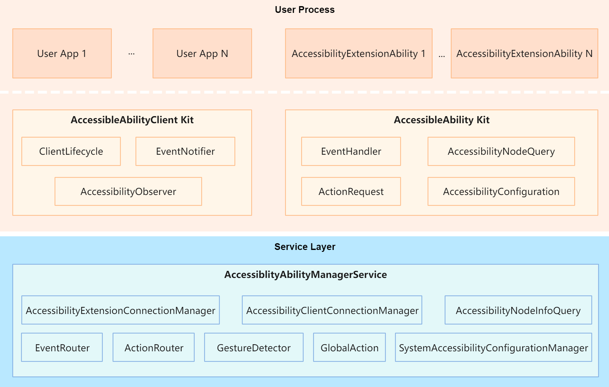

# Accessibility

# Introduction<a name="intro"></a>

The accessibility framework provides a standard mechanism for exchanging information between applications and accessibility applications and supports the development of accessibility applications to enhance the accessibility experience. The typical use cases are as follows:

1. Allow people with disabilities to use applications. For example, provide the screen reader for people with visual impairments.
1. Provide the capability to interact with applications. For example, offer the UI automatic test framework and the capability to develop accessibility applications based on UI responses.



# Directory Structure<a name="files"></a>

```
/foundation/barrierfree/accessibility
├── frameworks
│   ├── aafwk               # AccessibleAbility Kit implementation code
│   └── asacfwk             # AccessibleAbilityClient Kit implementation code
├── interfaces
│   ├── innerkits           # Internal APIs of AccessibleAbility and AccessibleAbilityClient
│   └── kits                # Developer APIs of AccessibleAbility and AccessibleAbilityClient
├── sa_profile              # System service configuration files
├── services
│   └── aams                # Framework code of the AccessibleAbility management service
│   └── test                # Test code
├── test                    # Test code
└── util                    # Utility code
```

# Repositories Involved<a name="relevant"></a>

**accessibility**

[distributedschedule_samgr](https://gitee.com/openharmony/distributedschedule_samgr)

[appexecfwk_standard](https://gitee.com/openharmony/appexecfwk_standard)

[notification_ces_standard](https://gitee.com/openharmony/notification_ces_standard)

[multimodalinput_input](https://gitee.com/openharmony/multimodalinput_input)
